# N-Back Game Families

1.  Each daily session contains **10 blocks**.

2.  Each block contains **20 + n trials**.

3.  Each game has **2 speed settings**.

### There are 4 **game families**, each with **2–3 wrapper/syntax variants**.  **Family 1: XOR (disjunctive) N-backs** 

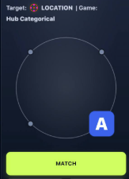

All games have 3 modalities - location, colour and letter/symbol.  
  
**Single N-back**  
  
Game variants:  
  
1. Categorical - 4 letters. 4 primary colours. 4 fixed locations  
2. Non-categorical - 4 random symbols. 4 colours from colour wheel. 4 random locations.  
3. Conceptual - 4 letters (with different fonts/cases), 4 colour categories (with variations of colours in each category (e.g. light blue and dark blue in same ‘blue’ category. 4 locations in same quadrant (within +/- 30deg of the 0, 90, 180, 270 angles). So this involves abstracting the concept from instances.  
  
Speed - 2 settings - 3 seconds ISI (default) - also 1.5 seconds ISI.

Both Hub versions use the same core rule: each trial shows a combined token with location + colour + symbol/letter, and at the start of each block the app cues which one to track. You press MATCH only when that cued feature is the same as it was N items ago, while ignoring the other two features. The game also throws in distractor trials where a non-target feature repeats, so part of the challenge is resisting the wrong match signal.

- XOR - categorical: the visible options are fixed and easy to label, like fixed positions, fixed colours, and fixed letters. So the task is more about basic n-back tracking with a stable visual vocabulary.

- XOR - non-categorical: the underlying rule is the same, but the surface mapping changes by block. The positions can rotate, the colour palette shifts, and the symbols come from a larger pool, so you cannot rely as much on a familiar fixed pattern. It is basically the same n-back logic with more abstraction and remapping load.

- XOR - **conceptua**l. This logic is extended to the ‘conceptual’ variant’

### **Family 2: AND (conjunctive) N-backs** 

Same logic as above but the match stimuli are conjunctions of 2 of the modalities - cued in each block - rather than just one of the modalities - with:

**Variation 1**:  
  
AND -categorical: 3 modalities - animals (pigs, dogs,cats, and birds), 4 classic colours and cardinal locations.

### 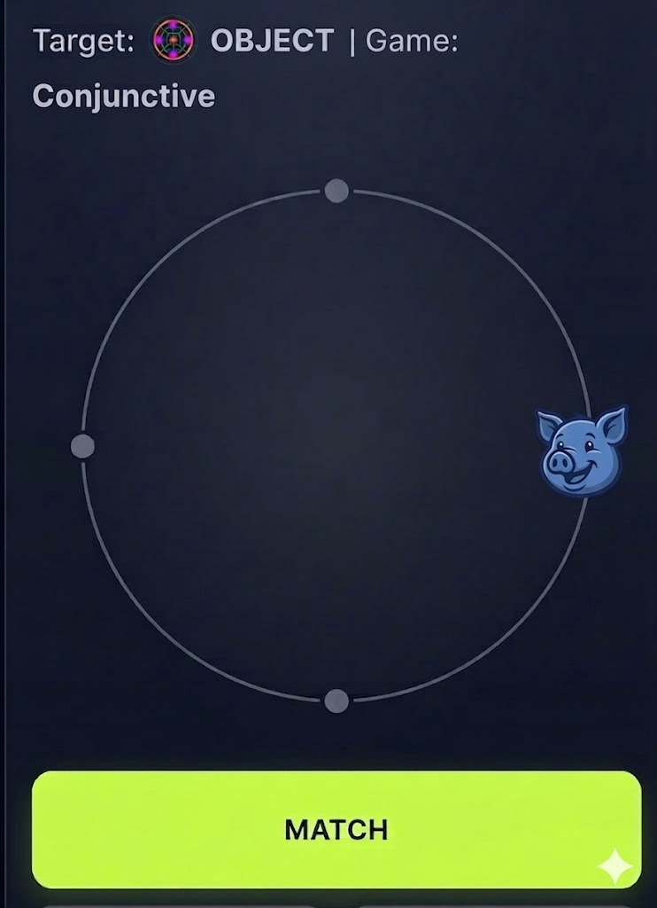

**Variation 2**:

Same game as above, but using random shapes, random colours on colour wheel, and random locations round the wheel.

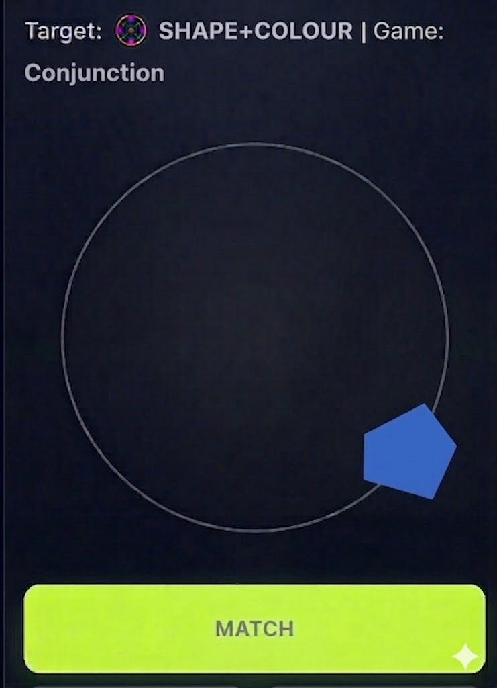

### 

### 

### **Family 3: Interference N-Back**

Same single modality at a time n-back as the game but with 2 modalities (not 3)  
  
**Game variant 1**: Symbol is an arrow with 4 directions (up, down, right left). Location on ring at 0 (top), 90deg (right), 180 (bottom) and 270 (left) - going clockwise. Position on the ring and the direction of the arrows is randomised from trial to trial, and blocks randomly present location on ring vs arrow direction for each block. Example stimuli shown here:

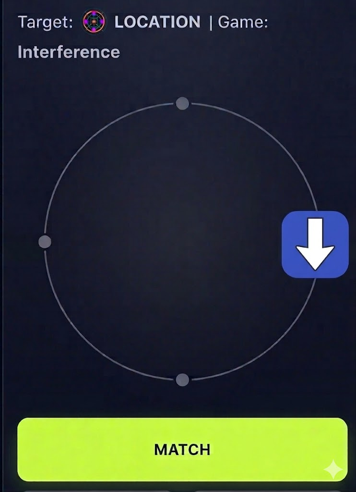

**Game variant 2**: (Stroop n-back)

Same game logic as the spatial game above, but the two stimuli sets are:  
  
Word: ‘BLUE’, ‘GREEN’ ‘GREY’ and ‘RED’  
Word ink colour: blue, green, grey, red.  
  
Each block the player is randomly cued to attend to word matches or ink colour matches. The choice of word and colour is randomised on each trial (so sometimes the two colours will randomly be consistent, but mostly they will be inconsistent). Example stimuli below.

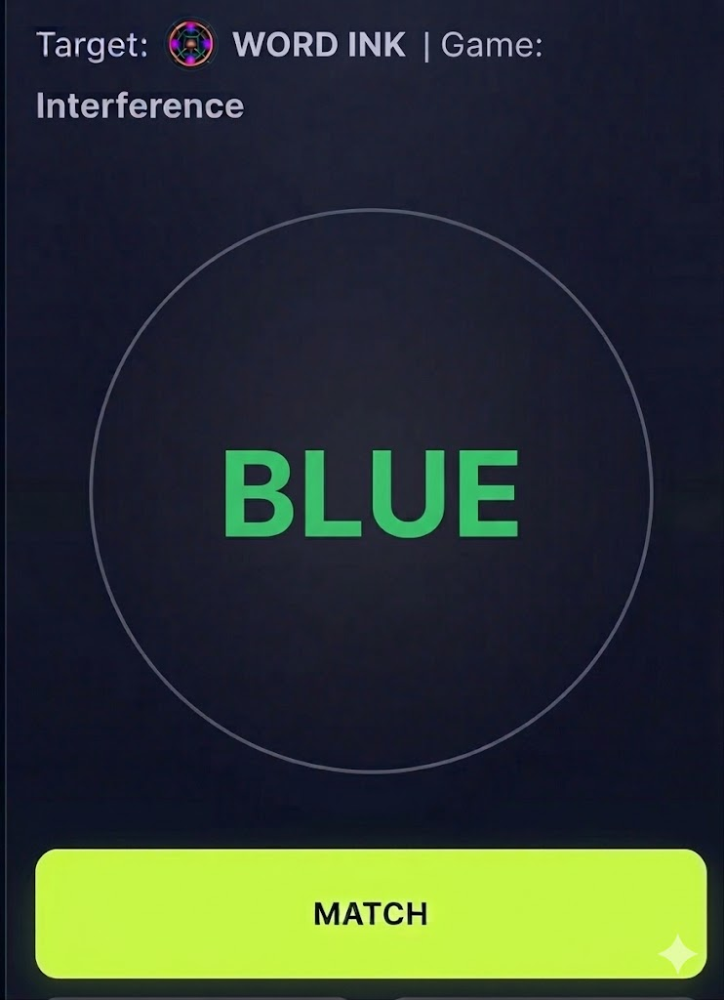

**Game variant 3**: (Conceptual stroop)

Same game logic in the conceptual variant in the XOR game - but the icon’s ‘left right up down’ can be represented by one of three types of graphic: a) face/yes looking direction, b) pointing hand, c) arrow. These are randomly interleaved in the block and the player needs to abstract the underlying direction concept. The location on the circle can be within +/- 30 deg from the 4 cardinal points (so the player needs to abstract the underlying location concept). Example stimuli below.

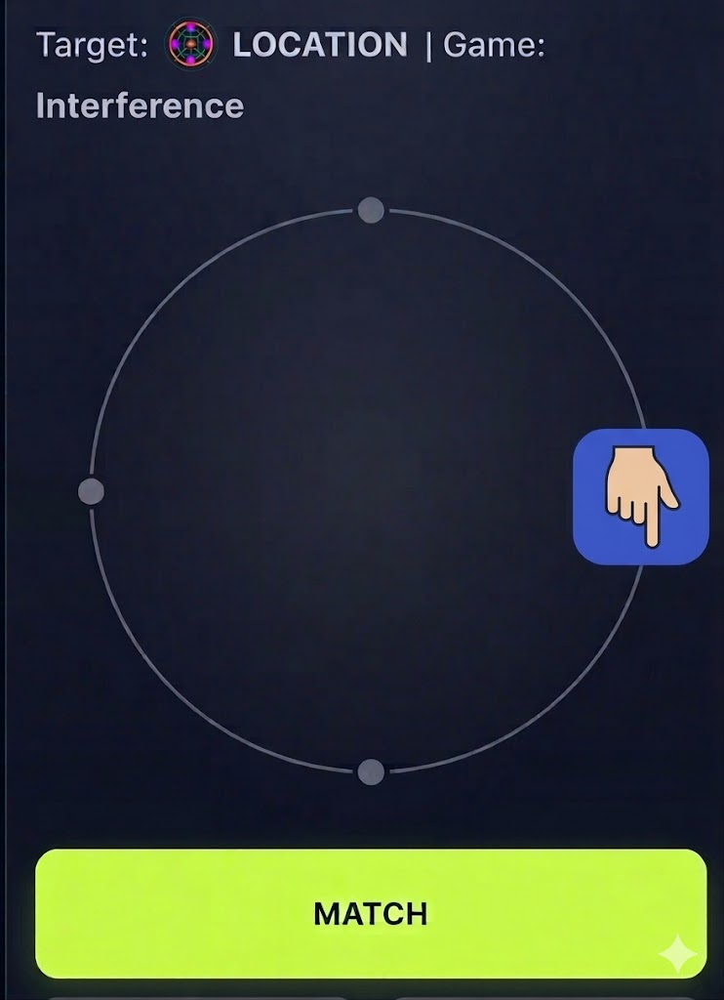

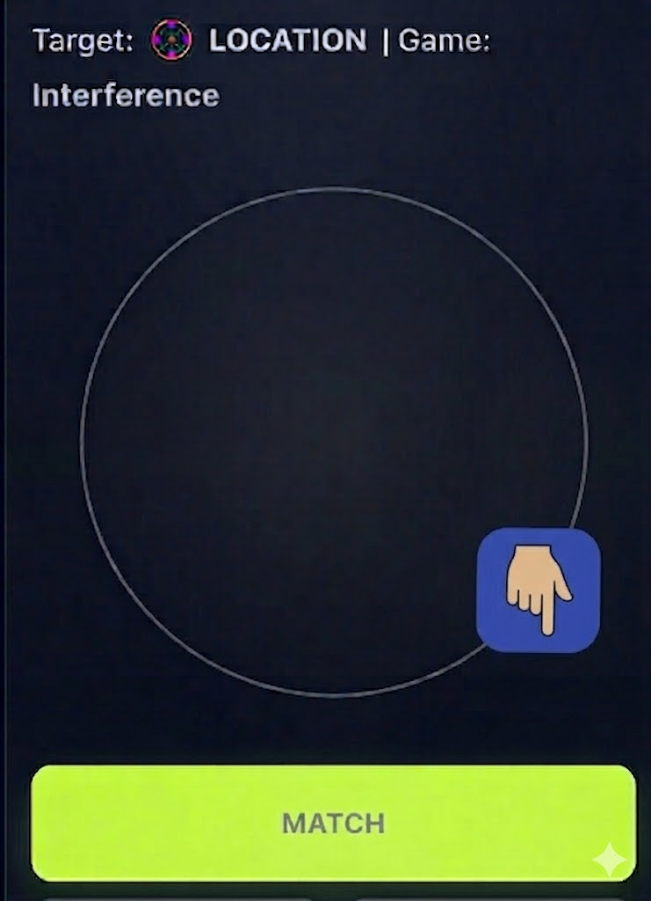

**Family 4: Emotional N-back**

**Variation 1:Visuo-spatial**

This is the same logic as the interference n-back: single modality at a time n-back but with 2 modalities (not 3) - these are -

1.  Emotion category: sad, angry, afraid, happy

2.  Location: up, down, left, right

Example stimuli below:

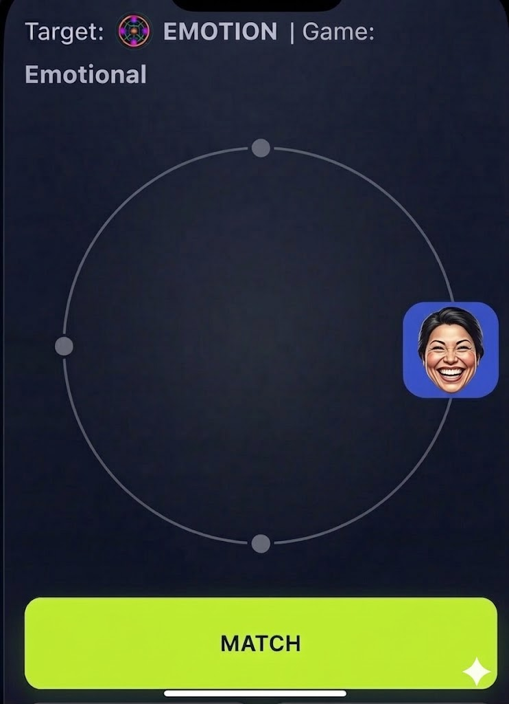 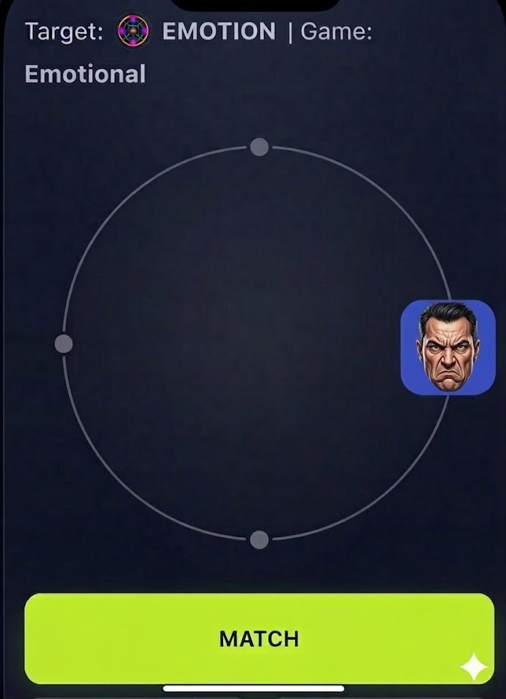

**Variation 2: Verbal:**  
  
Samae as game above but with the two modalities:

- Emotion category: ANGER/THREAT, SADNESS, HAPPY, NEUTRAL:

- Word ink colour (different shades): BLUE, RED, GREEN, GREY

Example stimulus below

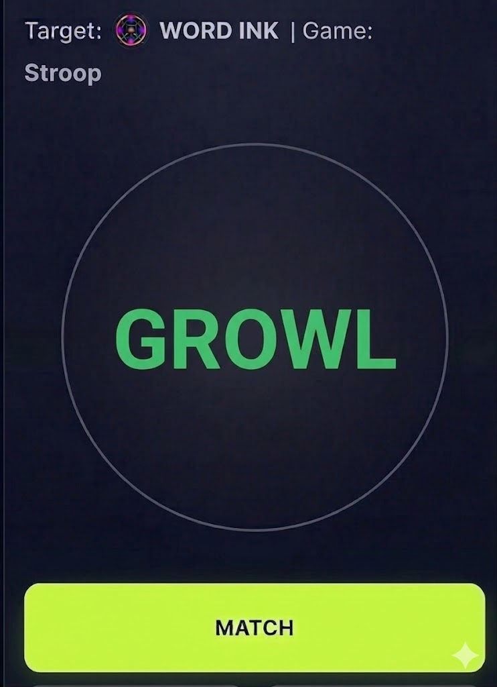

**Family 5: Relational N-back**

**Variant 1: Directions  
**

Same single n-back match game. Instead of one stimulus token presented on each trial, two stimuli in opposite locations on an 8 equi-node circle are shown (see images below). The two arrow tiles on each trial can be presented on any of the 4 possible alignments (vertical, horizontal and 2 diagonals). The arrow-tiles can be either pointing towards each other, away from each other, in the same direction as each other or at diagonals to each other. The task is to match on the relative direcitons of the arrow-tiles (these 4 relative directions are the 4 match stimuli in this relational n-back game). Illustrations of this game idea below.  
  
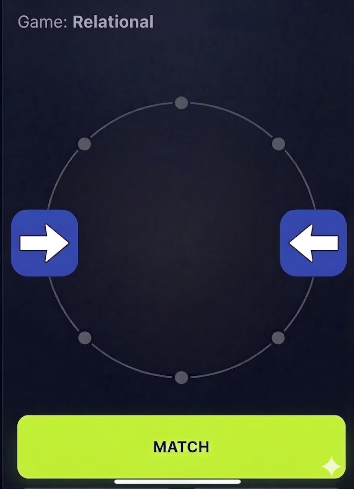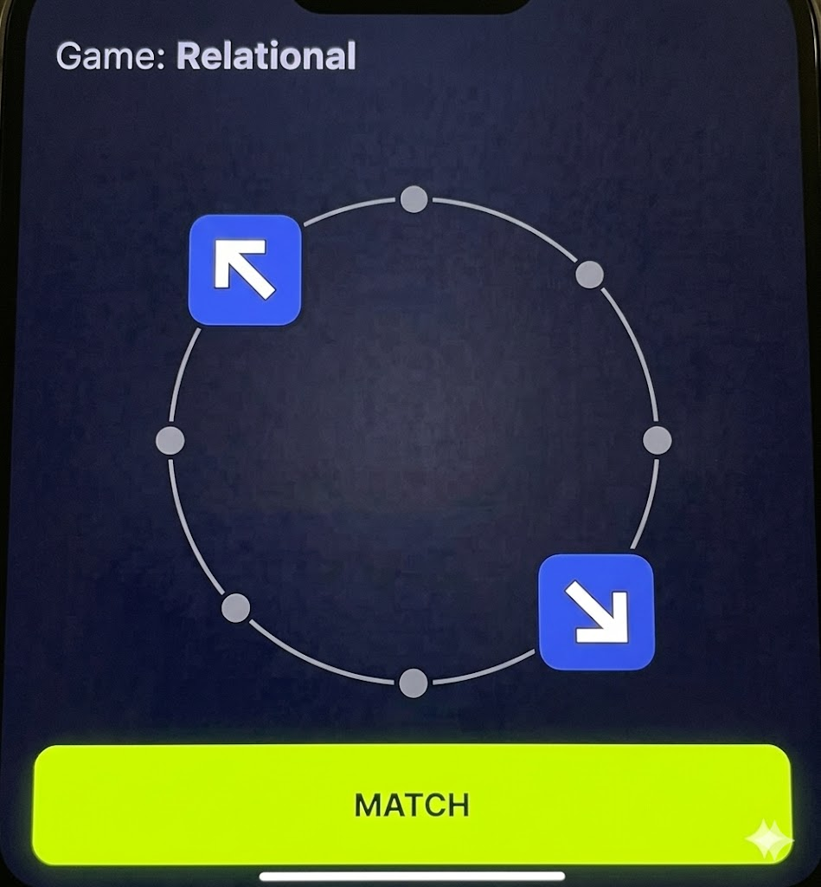

**Variant 2**: **Angles**

Same n-back match logic as above, but now we just have a central symbol defined by its angle - irrespective of orientation.

Equivalent angle sets - rotated randomly but always the same angle:

90 deg: ୮ く ∟  
Acute angle (e.g. 40 deg): Λ ＜  
Obtuse angle: (e.g. 140 deg) ㄑ 〉  
180 deg:＼丨ノ 一

Example Stimuli shown below:

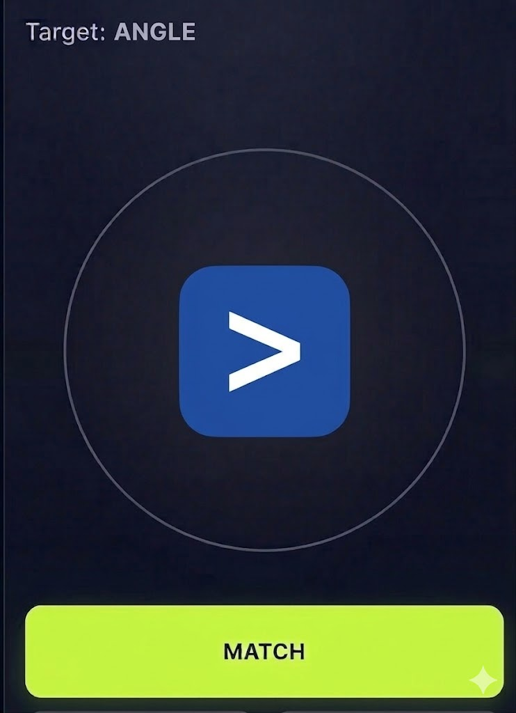

**Variant 3**: **Numbers**

Same n-back match logic as the games above, but now we have two numbers presented in rapid succession on the 8 pointed circle (e. 200msec apart):

The 4 relations to match are:  
  
1. Numbers increasing by 1 (any number pairs from 1 to 9 following this rule)  
2. Numbers decreasing by 1 (any number pairs from 1 to 9 following his rule)  
3. Numbers the same (any number pairs from 1 to 9 following this rule)  
4. Number pairs that are none of the above (any number pairs following this rule - e.g. 1 \> 4)

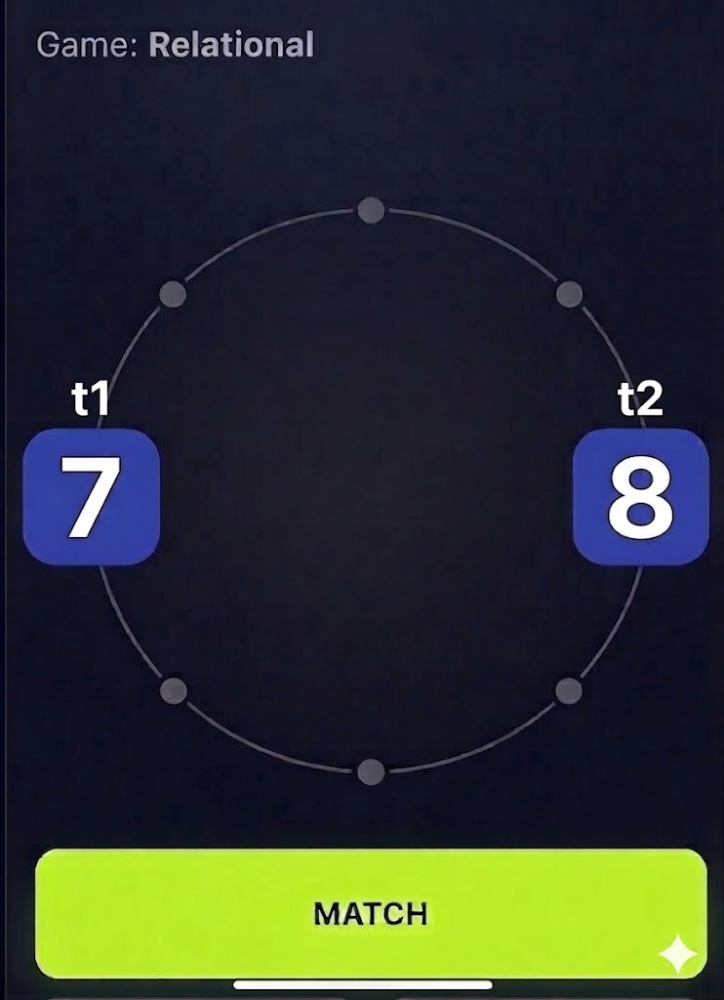 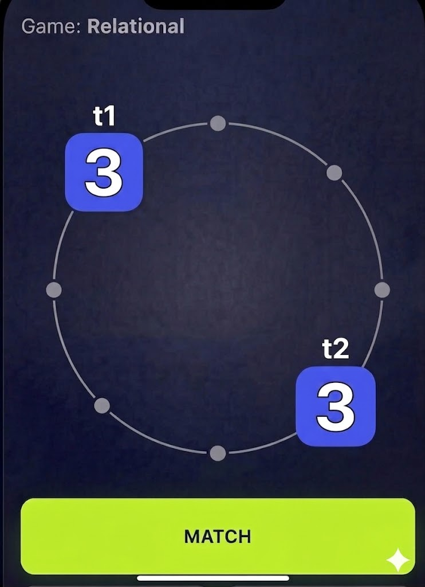

# Cognitive Skills Trained

**Core Cognitive Skills (Common to All Families)**

While the specific variants target different neural pathways, the foundational n-back structure requires a baseline level of higher-order executive functioning.

- This core n-back mechanic trains **Working Memory Updating** and **Maintenance**, forcing the central executive to continuously discard old information and encode new stimuli while holding the target variables in a readily accessible state.

- The game introduces distractor trials where non-target features repeat.

- Players must successfully resist the incorrect match signal.

- This establishes a baseline of **Interference Control** across all game types.

### **Family 1: XOR (Disjunctive) N-backs**

**Game Mechanics**

- This family utilizes categorical, non-categorical, and conceptual variants.

- The underlying n-back rule is consistent, but the surface mapping changes from block to block.

- In the non-categorical variant, positions can rotate, color palettes shift, and symbols are pulled from a wider pool.

- This design requires players to handle higher abstraction and an increased remapping load.

- The conceptual variant extends this logic further. Players must match based on broader categories, such as letters presented in different fonts/cases, variations within a color category (e.g., matching light blue and dark blue in the same 'blue' category), or locations falling within the same quadrant.

**Differentiating Skills: Cognitive Flexibility (Set-Shifting), Selective Attention, & Conceptual Abstraction** Because players cannot rely on a familiar or fixed pattern, this family heavily taxes **cognitive flexibility** (often called set-shifting). The brain must rapidly adapt to entirely new rule sets and conceptual mappings on the fly. Additionally, because each trial shows a combined token with location, color, and a symbol/letter , but the player must actively ignore two of those features to track the cued one, this game heavily trains **selective attention** and feature de-coupling.

Furthermore, the third variant explicitly trains **Conceptual Abstraction**. Because the visual representations change from trial to trial (e.g., seeing a light blue token followed by a dark blue token), the brain is forced to discard the precise, pixel-level visual data. Instead, the central executive must extract the higher-level conceptual category and maintain that abstract rule in working memory to successfully match the stimuli.

**Key References**

- Miyake, A., et al. (2000). The unity and diversity of executive functions and their contributions to complex "frontal lobe" tasks: A latent variable analysis. *Cognitive Psychology*.

- Collette, F., et al. (2005). Exploring the neural substrates of executive functioning. *Neuroscience & Biobehavioral Reviews*.

- Badre, D. (2008). Cognitive control, hierarchy, and the rostro–caudal organization of the frontal lobes. *Trends in Cognitive Sciences*.

### **Family 2: AND (Conjunctive) N-backs**

**Game Mechanics**

- This family utilizes the same core logic as the XOR family, but the match stimuli are conjunctions of two modalities that are cued in each block, rather than just a single modality.

- Variation 1 is categorical, featuring three modalities: animals (pigs, dogs, cats, and birds), four classic colors, and cardinal locations.

- Variation 2 uses random shapes, random colors from a color wheel, and random locations around the wheel.

**Differentiating Skills: Feature Binding & Associational Memory**

Unlike the XOR family which trains feature de-coupling, this family explicitly trains active feature binding. By requiring the player to match a conjunction of features (e.g., shape + color), the central executive is forced to rely on the episodic buffer to fuse separate visual and spatial streams into a single, cohesive representation. This arbitrary feature binding is a critical component of working memory capacity and a strong predictor of fluid intelligence.

**Key References**

- Baddeley, A. (2000). The episodic buffer: a new component of working memory? *Trends in Cognitive Sciences*.

- Oberauer, K. (2019). Working memory and intelligence—their correlation and their relation: Comment on Burgoyne et al. (2019). *Psychological Bulletin*.

### **Family 3: Interference N-Back**

**Game Mechanics**

- This game operates as a single modality n-back, but features two competing modalities instead of three.

- The first variant involves an arrow with four directions and locations on a ring. Position and direction are randomized, and blocks randomly cue the player to track either location or direction.

- The second variant is a "Stroop n-back" utilizing words (e.g., 'BLUE', 'GREEN') and different word ink colors. The player is randomly cued to attend to word matches or ink color matches per block, with the choice of word and color randomized on each trial so they are mostly inconsistent.

- A third "Conceptual stroop" variant uses randomly interleaved graphics (a face, a pointing hand, or an arrow) to represent directions, forcing the player to abstract the underlying direction or location concept.

**Differentiating Skills: Inhibitory Control, Conflict Resolution & Conceptual Abstraction**

This family isolates inhibitory control. By forcing the player to suppress prepotent responses (like automatically reading a word instead of identifying its color, or pointing the way an arrow faces instead of where it is located), the brain strengthens its top-down selective attention and conflict resolution pathways. The conceptual variant also heavily relies on conceptual abstraction to decouple concepts from their specific visual representations.

**Key References**

- Burgess, G. C., et al. (2011). Neural mechanisms of interference control underlie the relationship between fluid intelligence and working memory span. *Journal of Experimental Psychology: General*.

- Engle, R. W. (2002). Working memory capacity as executive attention. *Current Directions in Psychological Science*.

### **Family 4: Emotional N-back**

**Game Mechanics**

- This family utilizes the same logic as the interference n-back, using a single modality at a time but presenting two modalities.

- Variation 1 is visuo-spatial, pairing an emotion category (sad, angry, afraid, happy) with a location (up, down, left, right).

- Variation 2 is verbal, pairing emotion category words (e.g., ANGER/THREAT, SADNESS) with different shades of word ink colors.

**Differentiating Skills: Affective Working Memory & Emotion Regulation, and Conceptual Abstraction**

This family bridges cognition and emotion by training Affective Working Memory (AWM). It introduces highly salient emotional distractors into the working memory workspace, which demands increased emotional regulation. The brain must learn to maintain executive control, update memory, and filter out interference while processing "hot" affective stimuli. There is also a need to conceptually abstract the relevant emotional category from multiple individual faces or individual words.

**Key References**

- Schweizer, S., et al. (2019). The impact of affective information on working memory: A pair of meta-analytic reviews of behavioral and neuroimaging evidence. *Psychological Bulletin*.

- Joormann, J., & Gotlib, I. H. (2008). Updating the contents of working memory in depression: Interference from emotional distractors. *Journal of Abnormal Psychology*.

### **Family 5: Relational N-back**

**Game Mechanics**

- In this single n-back match game, players evaluate two stimuli presented in opposite locations on an 8 equi-node circle instead of one token.

- Variant 1 tasks players with matching the relative directions of two arrow-tiles, which can point towards each other, away from each other, in the same direction, or at diagonals.

- Variant 2 requires matching a central symbol defined strictly by its angle, completely irrespective of its orientation.

- Variant 3 involves two numbers presented in rapid succession, where the player must match the mathematical relation between them (e.g., numbers increasing by 1, decreasing by 1, staying the same, or none of the above).

**Differentiating Skills: Relational Integration & Fluid Reasoning**

This family targets relational integration, the fundamental building block of fluid intelligence. Rather than holding static items in mind, the central executive must abstract a rule or relationship from discrete parts, maintain that abstract relationship, and continuously compare it to incoming sets of relationships.

**Key References**

- Krawczyk, D. C., et al. (2008). Distraction during relational reasoning: The role of prefrontal cortex in interference control. *Neuropsychologia*.

- Kroger, J. K., et al. (2002). Prefrontal cortex mediates relational reasoning and working memory. *Journal of Cognitive Neuroscience*.

